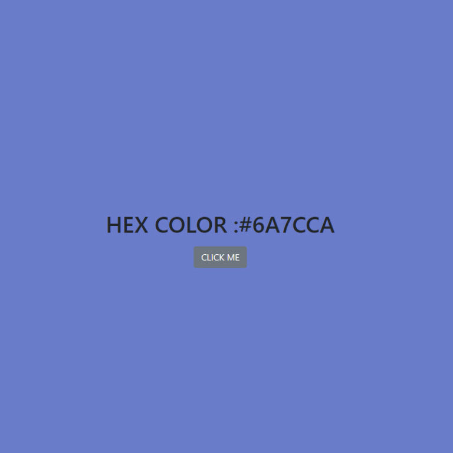

# Hex Change Background Color Project

Short and sweet HEX background color changing app.

# Project Objectives
The idea was to make a random hex value created from an array of all the possible different hex values, loop through them, and concatenate 6 different values to a String that begun with the # character.

Once the HEX value string is created, you'd simply change the background color to that value.

# New things learned or refreshed
I learnt that the KISS (Keep it simple stupid) principle. The simplest solution is probable the best solution.

# Biggest take away:
KISS. Keep it Simple. Make a working solution. Refactor if you must, later.
